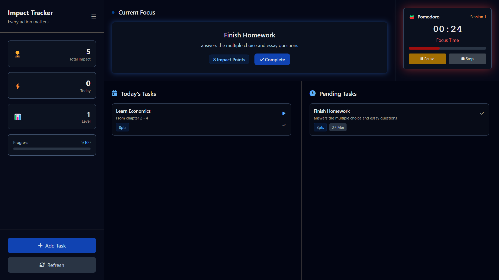

# Task Tracker

A simple impact-focused task management web application that helps you track meaningful activities and measure your daily impact. Built with vanilla JavaScript and Tailwind CSS.

## 🎯 Features

- **Impact Point System**: Assign impact points (1-10) to tasks based on their value
- **Progress Tracking**: Track total impact, level progression, and streaks
- **Quick Templates**: Pre-built task templates for common activities
- **Modern Dark UI**: Clean slate theme with smooth animations
- **Local Storage**: Tasks saved in JSON format locally
- **Responsive Design**: Works on desktop and mobile devices
- **Collapsible Sidebar**: Optimized layout with sidebar toggle

## 📸 Screenshots

### Main Dashboard

*Main dashboard showing tasks, progress stats, and impact tracking*

### Add New Task

*Task creation page with templates and impact point selection*